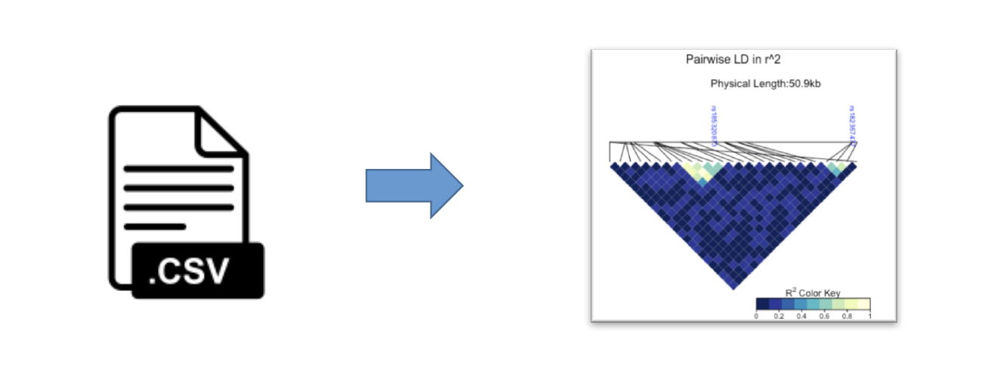
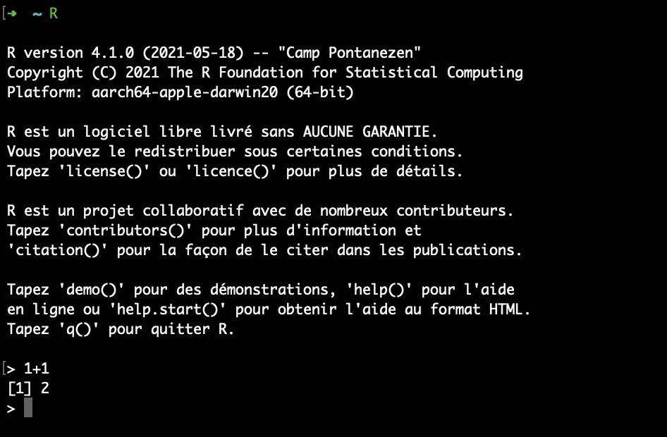
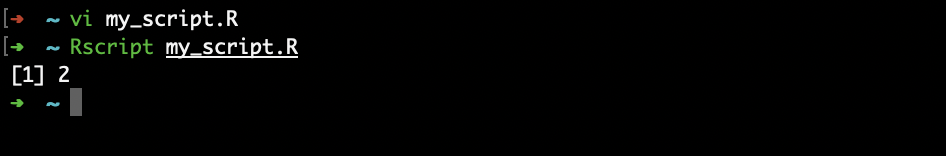
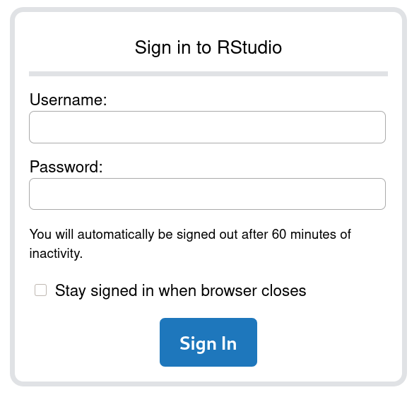
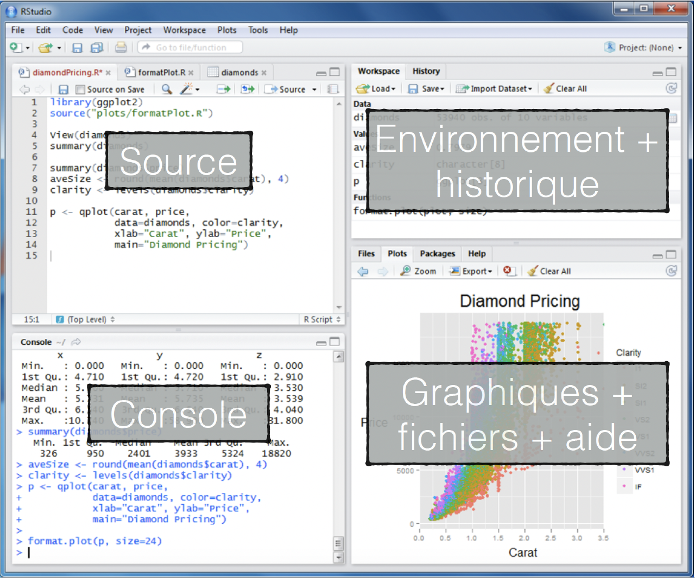
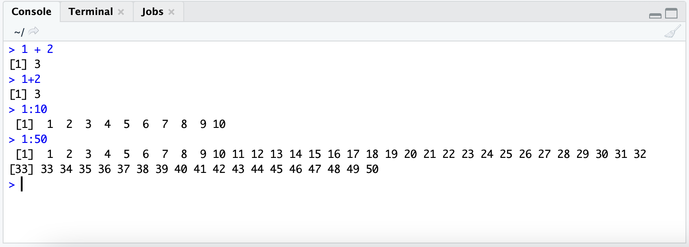
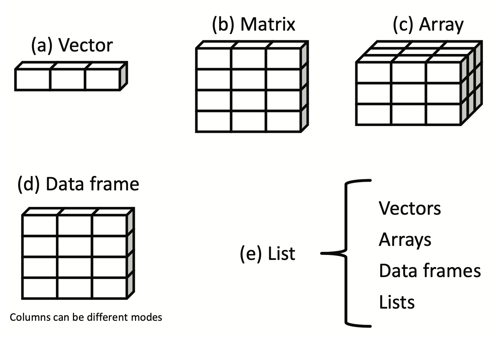
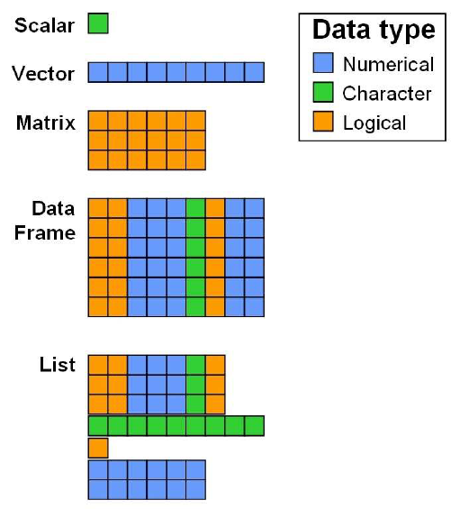
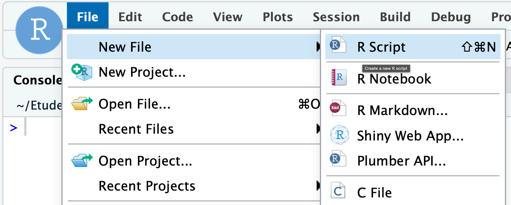
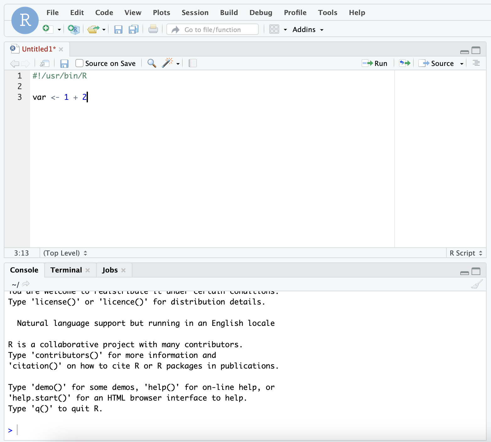

```{r setup, include=FALSE, echo = FALSE}
knitr::opts_chunk$set(fig.align = "center")
```

# Introduction

## Objectifs

Utilisation *minimale* de R dans un contexte de recherche scientifique:

```{r out.width = '100%', echo=FALSE}

```


1. Pouvoir modifier des données
2. Pouvoir extraire des sous-ensembles de données (indexing)
3. Pouvoir découvrir et utiliser une fonction
4. Produire des scripts pour un travail reproductible et documenté

## Plan
\tableofcontents

## Presentation du language R

* Le langage R se situe dans la catégorie des langages interpétés (comme Bash, Python, vs. langages compilés: C++, java )
* Il est spécialisé pour les analyses statistiques et la visualisation de données

```{r out.width = '50%', echo =FALSE, fig.cap="R for Data Science (H. Wickham)"}
knitr::include_graphics("figure/data-science.png")
# R for Data Science (H. Wwickham)
```

Une suite logicielle, ou environement intégré qui comprend:

* Un langage de programmation
* Un programme intéractif (~ REPL: *read-eval-print-only*)
* Des outils graphiques
* Structure d'intégration de librairies (packages)
* Et plus ...


## Pourquoi apprendre R

- Analyse de donnée (data science)
- Données diverses (bio-statistiques / génomiques / biologiques)
- Produire des graphiques de haute qualité (articles scientifiques)
- Grande communauté active pour ajouter des fonctionnalités et permettre des analyses spécialiséees

```{r out.width = '30%', echo =FALSE, fig.cap="Ceci n'est pas R!"}
knitr::include_graphics("figure/excel.png")
# Ceci n'est pas R
```


Quand utiliser R:

- Explorer les données
- Analyser
- Représenter
- Communiquer

## R: mode interactif vs. mode script

R peut être utilisé de 2 façons:

* le mode **intéractif**: utile pour faire de l'exploration de données. *(Ctrl+D pour quitter le mode interactif)*

```{r out.width = '50%', echo=FALSE}

```

* le mode **script (*Rscript*)**: utile pour réutiliser des commandes utilisées régliérement. Permet aussi de sauvegarder les détails d'une analyse (*#reprductibility*) 

```{r out.width = '50%', echo=FALSE}

```


## L'interpréteur

* A la console, l'interpréteur attend qu'on communique avec lui via le langage qu'il comprend: **R**.
* Toute erreur de syntax entrainera une incompréhension de l'interpréteur et produira une erreur.

Erreurs fréquentes:

* Mauvaise orthographe;
* Utiliser une fonction inconnue;
* Oublier de fermer une apostrophe (pour les chaines de caractères) ou une parenthèse;
* Argument manquant à une fonction (pas de valeur par défaut);
* etc ...


# Environnement de travail

## Commencement avec R

* R peut être téléchargé et installé à partir de *https://cran.r-project.org/*
* Dans le cadre du cours, un serveur **Rstudio** à été installé pour vous et dispobible à l'adresse: *https://bif-rstudio.compbio.ulaval.ca*
```{r out.width = '35%', echo=FALSE}

```


## Rstudio

Environnement de travail pour le développement en R

\begin{columns} 
\column{0.6\textwidth}

```{r out.width = '100%', fig.cap="Interface Rstudio", echo=FALSE}

# R for Data Science (H. Wwickham)
```

\column{0.40\textwidth}

Panels:
\begin{itemize}
    \item \textbf{Source}: vos scripts *
    \item \textbf{Console}: vos commandes
    \item \textbf{Environnement}: Variables, Historique, Git, etc.
    \item \textbf{Plot, Packages, Help}
\end{itemize}

\end{columns} 

\* Les commandes écrites dans le panel *Source* peuvent être envoyées au panel *Console*.

<!-- ## erf -->

<!-- Vous tapez du code R dans la ligne inférieure du volet de la console RStudio, puis vous cliquez sur Entrée pour l'exécuter. Le code que vous tapez est appelé une commande, car il va demander à votre ordinateur de faire quelque chose pour vous. La ligne dans laquelle vous le tapez s'appelle la ligne de commande. -->

# Un premier contact avec R

## Premières commandes

Avec Rstudio, écrivez vos commandes dans la **console** (panel en bas à gauche) puis tapez sur la touche **\<Enter\>** pour commander à R d'interpréter et d'exécuter votre commande.


```{r out.width = '80%', echo=FALSE}

# R for Data Science (H. Wwickham)
```

* '**>**' est l'invite de commande
* les espaces sont ignorés
* les résultats sont généralement précédés de leur position sur la ligne de retour **[1]**


## Les Variables

Les résultats des commandes exécutées précédement sont juste affichés dans la console et ne sont pas sauvegardés. 
On utilise des *variables* pour stocker les résultats.
On attribue une donnée à une variable avec l'opérateur: `<-`


```{r, echo = TRUE}
ma_variable <- 1
chien <- "chat"
a <- 1 + 2
```

En tapant le nom de la variable, son contenu est dévoilé
```{r, echo = TRUE, results='hold'}
ma_variable
chien
a
```

**Remarque:** Les noms des variables ne doivent pas commencer par un nombre et ne doivent pas contenir de caractères spéciaux: `^`, `!`, `$`, `@`, `+`, `-`, `/`, or `\*`.


## Les vecteurs (1)

R est un langage spécialisé pour les calculs vectoriels et matriciels (tables d'expression). 
C'est un langage basé sur la notion de vecteur (*vector*).

Avec R, le calcul mathématique est simplifié et nécessite peu de boucle (for, while, ...).

Ici, tout est vecteur et on combine plusieurs vecteurs avec la fonction `c()`.

```{r, echo=TRUE}
var1 <- c(1,2)
var2 <- c("chien", "chat")
var3 <- c(TRUE, TRUE, FALSE)
```
```{r, echo=TRUE, results='hold'}
var1; var2; var3
```

## Les vecteurs (2)

Les éléments d'un vecteur sont accessible via leur index dans le vecteur et l'utilisation de crochets simples `[]`.

```{r, echo=TRUE, results='hold'}
var <- c("chien", "chat", "mouton", "oiseau")
var[1]; var[2]
```

On peut sélectionner plus qu'un seul élément 
```{r, echo=TRUE, results='hold'}
var[c(2,4)]  # elts 2 et 4   = c(var[2], var[4])
```

Alternativement, il est possible d'extraire des tranches (*slice*) avec l'opérateur "`:`"

```{r,  echo=TRUE, results='hold'}
var[2:4] # elts de 2 à 4  = c(var[2], var[3], var[4])
```


## Les différents types de scalaires

Chaque élément constitutif d'un vecteur est nommé scalaire (*scalar*).
Il existe plusieurs types primaires de scalaires:

\begin{columns} 
\column{0.25\textwidth}

```{r out.width = '100%', fig.cap="Advanced R", echo=FALSE}
knitr::include_graphics("figure/summary-tree-atomic.png")
# Advanced R (H. Wwickham)
```

\column{0.75\textwidth}
\begin{itemize}
    \item les \textbf{valeurs numériques}, incluant `double` (3.14; -0.65) et `integer` (1; 2; -27) (\texttt{1L});
    \item les \textbf{chaines de caractères}, \textit{texte}, défini par des 'simples' ou "doubles" guillemets;
    \item les \textbf{valeurs logiques}, \texttt{TRUE}/\texttt{FALSE} (ou en abrégé \texttt{T} et \texttt{F});
\end{itemize}

\end{columns}

Un peu à part, il y a aussi la valeur `NULL` qui sert de valeur *vide* et également la valeur manquante `NA`.

**Remarque:** Régulièrement utilisé, le type *facteur* (*factor*) est dérivé des types primaires et sert à représenter des données catégorielles.

```{r}
a <- factor(c("chien", "chien", "chat")); a
```


## Opérateurs arithmétiques fréquents 


| Opérateur |   Description  |
|:---------:|:--------------:|
|    `+`    |    Addition    |
|    `-`    |  Soustraction  |
|    `*`    | Multiplication |
|    `/`    |    Division    |
|    `^`    |    Exposant    |

```{r}
x <- 1 + 2
```


## Opérateurs logiques (1)

Les opérateurs suivant permettent de faire des conparaisons entre plusieurs vecteurs.

Les vecteurs doivent avoir la mème taille, ou multiple (recyclage), sinon une erreur est produite.

Le résultat de l'opération sera (presque) toujours du type logique (`T`/`F`).

| Opérateur  | Description        |
|:----------:|:------------------:|
| >          | Plus grand que     |
| <          | Plus petit que     |
| >=         | Plus grand ou égal |
| <=         | Plus petit ou égal |
| ==         | Exactement égal    |
| !=         | Différent de       |
| \|         | OU                 |
| &          | ET                 |
| is.na(x)   | x vaut NA          |
| is.null(x) | x vaut NULL        |

## Opérateurs logiques (2)

```{r}
1>2
c(1,2) == 2
1:3 != c(2,2,2)
1:6 == c(3,2)
```


```{r, results="hold"}
is.na(c(NA,1)); is.null(NULL); is.null(0)
```

# Les fonctions

Une fonction est un ensemble d'instructions organisées ensemble pour effectuer une tâche spécifique. 
Les fonctions peuvent attendre un ou plusieurs arguments.
R dispose d'un grand nombre de fonctions intégrées et l'utilisateur peut créer ses propres fonctions.

Les fonctions peuvent effectuer des tâches comme:

- Créer ou retourner des valeurs
- Créer ou modifier des objects
- Questionner ou modifier l’environnement
- Créer des sorties graphiques ou texte

```r
getwd()
sum(1,2)
c()
read.table(...)
quit()
plot()
```
Obtenir de l'aide/documentation d'une fonction avec `?` ou `help()`:

```r
?nom_de_la_fonction
help(nom_de_la_fonction)
```


## Déclarer une fonction 

Pour créer une fonction, on utilise le terme `function(...)`.

```{r}
# fonction pour multiplier arg1 par arg2
multiply <- function(arg1, arg2){
   value <- arg1 * arg2
   return(value)
}
```
```{r}
multiply(arg1 = 1, arg2 = 3)
var <- multiply(3,4)
var
```

## Les packages

R vient avec beaucoup de fonctions de base.
Des fonctions supplémentaires peuvent être ajoutées sous forme de packages.

Il existe 2 dépots officiels de packages: CRAN (https://cran.r-project.org) et 
BioConductor (https://www.bioconductor.org)

Installer un package (package sur CRAN):
```r
install.packages()
```


Charger un package:
```r
library(...)
```

# Les structures de données

## Structures principales

En informatique, une structure de données est une manière
d'organiser les données pour les traiter plus facilement
(définition wikipedia).

```{r out.width = '70%', echo=FALSE, fig.cap="R in Action, R. I. Kabacoff"}

```


## Les vecteurs (3)

La structures principale est le vecteur et il en existe 2 formes:

- les vecteurs atomiques (vu plus hauts)
- les listes (voir après)

Les vecteurs:

- Ils ont un même type (`numeric`, `character`, ...)
- On accède aux éléments avec `[`
- Quelques fonctions associées

| Fonction | Description                              |
|:--------:|------------------------------------------|
| seq      | Création d'une séquence numérique bornée |
| :        | Raccourci de seq                         |
| rep      | Répéter la meme valeur plusieurs fois    |
| length   | Nombre d'éléments                        |
| summary  | Résumé d'un objet                        |
| sum      | Somme des éléments d'un vecteur          |
| mean     | Moyenne des éléments d'un vecteur        |
| median   | Medianne des éléments d'un vecteur       |


## Les listes *(list)*

Comme les vecteurs, c'est une structure de données mais non homogènes.

```{r}
a <- c(1,2,3)
b <- c("voiture", "avion")
d <- c(TRUE, FALSE, TRUE, TRUE)
x <- list(a, b, d)
```

```{r}
x
```

On accède aux éléments d'une liste non nommée avec `[[`.

```{r}
x[[1]]
```

## Les listes *(list)* (2)

Chaque éléments d'un liste peut aussi être nommé.

```{r}
y <- list(name1 = a, name2 = b)  # liste nommée
y
```

On peux accéder aux éléments d'une liste nommée avec `$` ou `[[`.

```{r}
y$name1
y[["name1"]]
```


## Les matrices

Les matrices sont des structures de même type et de dimension 2.
Ce sont des tableaux avec des lignes et des colonnes.

Voici l'exemple:

$$
A = 
\begin{bmatrix}
2 & 4 & 3\\
1 & 5 & 7
\end{bmatrix}
$$
```{r}
A <- matrix(data = c(2,1,4,5,3,7), ncol = 3, nrow = 2, byrow = FALSE)
A
```

## Les matrices (2)

Avec des matrices (`matrix`), on peut accéder à des colonnes / lignes spécifiques, 
des éléments précis (case) ou encore des sous-sensemble de la matrice.

```{r}
A[2,]  # la deuxième ligne
A[,2] # la deuxième colonne
A[2,2] # deuxième élément de la deuxième colonne
A[,2:3] # sous ensemble de A composé des colonnes 2-3 et toutes les lignes
```

# **TP1**

## Les *data.frames*

Un `data.frame` est aussi un tableau à 2 dimensions.
C'est un aggregat de colonnes (vecteurs). 
Contrairement aux matrices, les colonnes d'un data.frame peuvent avoir des types différents.

On crée un data.frame avec:
```{r}
col1 <- c(1,2,3)
col2 <- c(TRUE, TRUE, FALSE)
col3 <- letters[2:4]
df <- data.frame(col1, col2, col3)
df
```

On accède aux éléments d'un `data.frame` comme une matrice.

## Résumé des structures de bases

```{r out.width = '50%', fig.cap="A short Introduction to statistics using R, K. Steinmann" , echo=FALSE}

```

# Importer et exporter des données

## Chargement des données

* La fonction `read.table` permet de charcher des tableaux dans R sous la forme d'un data.frame.

* La fonction `write.table` permet de sauvegarder un data.frame dans un fichier
texte.

* Dans les 2 cas, il faut fournir lw chemin d'accès vers le fichier à lire ou à écrire (cf. chemin relatif/absolu).

```{r, eval=FALSE, echo=TRUE}
var <- read.table("./donnees.txt")
write.table(x=var, file="donnees.txt")
```

Pour un fichier `.csv` (champs séparés par une virgule):
```{r, eval=FALSE, echo=TRUE}
var <- read.csv("./donnees.csv")
write.csv(x=var, file="donnees.csv")
```

Charger (et sauvegarder) un seul objet R:
```{r, eval=FALSE, echo=TRUE}
var <- readRDS("./donnees.Rds")  # format Rds
saveRDS(var, file="donnees.csv")
```

Charger (et sauvegarder) l'environnement de travail:
```{r, eval=FALSE, echo=TRUE}
load("workspace.RData")  # format RData / Rda
save(var1, var2, file="donnees.RData")  # Sauvegarde de var1 et var2
save.image(file="./workspace.RData")  # environnement complet
```

# Les scripts


\begin{columns} 
\column{0.60\textwidth}
```{r fig.show="hold", out.width="90%", echo=FALSE}

```

\begin{itemize}
   \item Documente précisément votre travail
   \item Permet de reproduire votre travail
   \item Vous permet de réutiliser votre code pour d’autres projets
   \item Doit contenir toutes les étapes réalisées (mais pas les erreurs ou essais)
   \item Doit contenir en commentaire, l’information sur ce qui n’est pas évident dans le déroulement des opérations.
\end{itemize}

\column{0.40\textwidth}

```{r out.width = '100%', echo=FALSE}

```

\end{columns}

# **TP2**

# **TP3**