```{r setup, include=FALSE}
knitr::opts_chunk$set(echo = TRUE)
library(tidyverse)
library(ggplot2)
require(gridExtra)
library(mixOmics)
data("breast.TCGA")
knitr::opts_chunk$set(fig.align = "center", 
                      message = FALSE, 
                      warning = FALSE)
set.seed(123)
```


# Introduction

```{r,  out.width = '100%', echo=FALSE}
knitr::include_graphics("figure/ggplot2-intro.png")
```


## Plan
\tableofcontents

## Objectifs

* graphiques usuels avec R (`base` et `graphics`)
* utilisation du package `ggplot2`
* `tidyverse` : manipulation de data.frame pour ggplot2

## Les graphiques avec R

* Créer des graphiques *(plots)* avec des lignes de codes
* Répliquer et modifier
* Reproductibilité et partage
* R de base (`graphics`) pour des graphiques dans les publications scientifiques
* Des packages spécialisés: `ggplot2` et autres ...

# Base

## La fonction `plot()`


```{r, echo=TRUE, out.width='70%', fig.align="center"}
data("diamonds")
par(mfrow=c(2,2))  # affichage des graphiques en grille 2x2
plot(diamonds$clarity) # categorical / factor
plot(diamonds$x[1:90]) # continue / numeric
plot(diamonds$x[1:50], diamonds$y[1:50]) # numeric, numeric
```

##

```{r, echo=TRUE, out.width='80%', fig.align="center"}
par(mfrow=c(2,2))  # affichage des graphiques en grille 2x2
plot(diamonds$clarity, diamonds$color) # factor / factor
plot(diamonds$color, diamonds$clarity) # factor / factor
plot(diamonds$clarity, diamonds$price) # factor / numeric
```

## Courbe (line chart)

```{r, echo=TRUE, out.width='60%', fig.align="center"}
x <- 1:10
y <- sample(1:4,size = 10, replace = TRUE)
plot(x = x, y = y, type = "l", col = "red")
```

##

Graphique en 2 dimensions pour observer la relation entre 2 variables (ou une variable en fonction du temps).

Nécessite au moins 2 vecteurs:

* `x`: Valeurs sur l'axe des abscisses (vecteur)
* `y`: Valeurs sur l'axe des ordonnées (vecteur)
* Peut s'écrire: `plot(y ~ x)`

Autres arguments:

* `type`: `'p'` pour des points, `'l'` pour des lignes, `'b'` pour les deux, ...
* `main`: ajouter un titre
* `xlim = c(1,3)`: *zoom* sur x (aussi `ylim`)
* `col`: couleurs
* `xlab`, `ylab`: légende en x, y
* `pch`: forme des points
* `lty`: type des lignes

Autres options: `help(plot)`

## Ajouter des lignes avec `line()`

```{r, echo=TRUE, out.width='50%', fig.align="center"}
z <- sample(3:5,size = 10, replace = TRUE)
plot(x = c(), xlim = c(1,10), ylim = c(1,5), main = "2 variables",
     xlab = "X - lab", ylab = "Y - lab") # empty
lines(x, y, type = "l", col = "red")
lines(x, z, type = "l", col = "blue", lty = 2)
legend("bottomleft", 
       legend = c("y", "z"),
       col = c("red","blue"),
       lty = c(1,2))
```

## 2 - Le nuage de points (scatterplot)

- Représente la relation entre 2 variables.
- Nécessite 2 vecteurs

```{r, echo=TRUE, out.height='50%', fig.align="center"}
data(iris)
plot(x = iris$Sepal.Length, y = iris$Sepal.Width, col = as.factor(iris$Species), main = "scatterplot", pch = 4)
legend("topright", 
       legend = c("setosa","versicolor","virginica"),
       col = c(1,2,3),
       pch = c(4))
```

## Autres plots

```{r, echo=TRUE, out.width='60%', fig.align="center"}
par(mfrow = c(1,2))
hist(iris$Sepal.Length, main = "Histogram")
barplot(table(diamonds$clarity), main = "Barplot")
boxplot(diamonds$clarity)
```

##

```{r, out.width='90%'}
data <- as.matrix(cor(mtcars))
heatmap(data)
```

## Sauvegarder un graphique

```{r, eval=FALSE}
# 1- ouvrir une sortie graphique (png, jpeg, tiff, ...)
png("~/Documents/my_plot.png")

# 2- faire le graphique
heatmap(data)

# 3- fermer la sortie graphique
dev.off()
```

Remarque: avec `pdf()` il est possible de sauvegarder plusieurs graphiques dans le même fichier.

# GGplot2

## Introduction à ggplot2

Avantages: 

- Grammaire graphique cohérente (Wilkinson, 2005)
- Permet une construction rapide de graphiques simples
- Très flexible
- Système de thème pour polir l'apparence des graphiques
- Système graphique mature et complet
- Beaucoup d'utilisateurs, liste de diffusion active

Limites:

- Graphiques en 3 dimensions,
- théorie des graphes (voir le paquet igraph)
- Graphiques interactifs


>  "In brief, the grammar tells us that a graphic maps the **data** to the **aesthetic attributes*** (colour, shape, size) of **geometric objects** (points, lines, bars). The plot may also include **statistical** transformations of the data and information about the plot’s **coordinate system**. **Facetting** can be used to plot for different subsets of the data. The combination of these independent components are what make up a graphic."  H. Wickham

## appartée sur le tidyverse

```{r, out.width='50%', echo=FALSE}
knitr::include_graphics("figure/tidyverse-packages.png")
```

Tidy data:

1. Each variable forms a column.
2. Each observation forms a row.
3. Each type of observational unit forms a table.


## Syntaxe de `ggplot2`

```{r}
library(ggplot2)
myplot <- ggplot(data = iris, 
                 mapping = aes(x = iris$Sepal.Length, 
                               y = iris$Sepal.Width, 
                               color = iris$Species)) +
   geom_point()
```

* appel initial: `ggplot(...)`
* plus des *layers*

Un *layer* est défini par:

* data
* aesthetic mappings
* geometric objects (geom)
* statistical transformation (stats)
* scale
* faceting

## 1 - Data

Les données doivent être en format data.frame et contenir idéalement toutes les informations (colonnes) pour le mapping des asthetics.

Les données peuvent être fourni lors de l'appel initial: `ggplot(data = ...)`

Ou à chaque layer (geoms): `ggplot() + geom_point(data = ...)`


**Remarque:**
Le data.frame doit être souvent en format *long*.

```{r, echo=TRUE}
tmp <- breast.TCGA$data.train$mrna[1:5,1:5]
rownames(tmp) <- paste0("Sample_", 1:5)

tmp2 <- tmp %>% as.data.frame() %>% rownames_to_column("SampleID") %>% 
   pivot_longer(names_to = "Gene", values_to = "Value",  -c("SampleID")) 
```

```{r, out.width='40%', echo=FALSE}
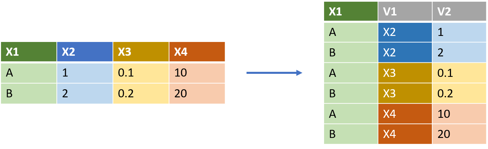
```


## 2 - Aesthetics

On utilise la fonction `aes()` pour *mapper* les valeurs du data.frame aux paramètres de ggplot.

Une colonne (variable) pour les valeurs en X, une colonne pour les valeurs en Y, une autre pour les couleurs, formes, etc ...

**Remarque:**
Certains paramètres peuvent être défini globalement par une constante.
On fait donc une différence entre le *setting* et le *mapping* (qui utilise `aes()`).


```{r, out.width='40%', echo=TRUE, eval=FALSE}
ggplot(iris, aes(x = Sepal.Length, y = Sepal.Width)) + 
   geom_point(aes(color = Species)) + ggtitle("Mapping")

ggplot(iris, aes(x = Sepal.Length, y = Sepal.Width)) + 
   geom_point(aes(color = "red")) + ggtitle("Setting")
```

\begin{columns} 
\column{0.5\textwidth}

```{r, echo=FALSE, out.width="90%", fig.align="center"}
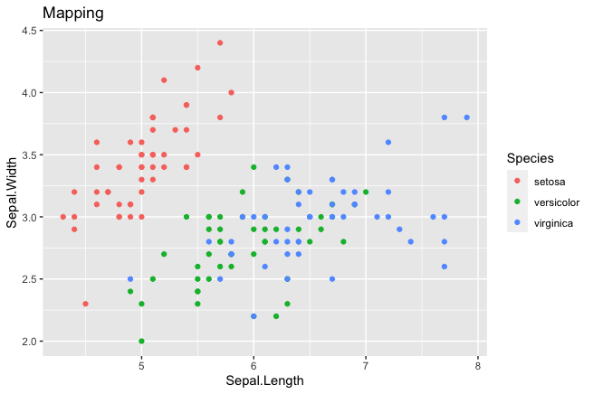
```
\column{0.5\textwidth}
```{r, echo=FALSE, out.width="90%", fig.align="center"}
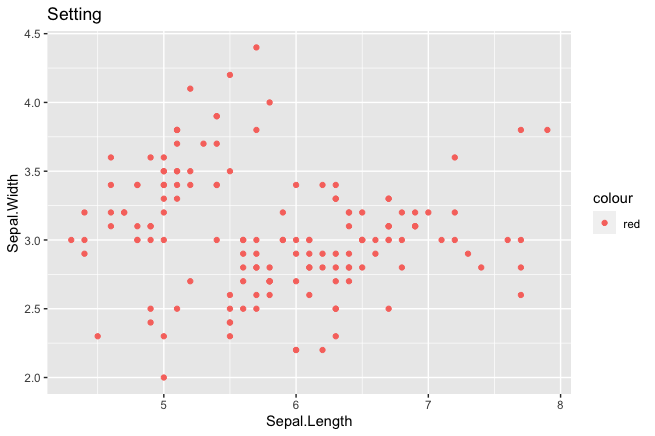
```
\end{columns}

## 3 - Les objets géométriques *(geoms)*

* Les *geoms* sont les objets géométriques pour réprésenter les données.

* Si les asthetics répondent à la question: *quelles sont les variables à représenter?* ***(Quoi?)***;
les geoms répondent à la question: ***Comment?***
* En fonction du nombre de variable à représenter (1,2,3), nous avons accès à différentes formes géométriques (nuage de points, lignes, barres, surfaces, ...).
* Chaque geom appèle un *layer*. Les données, aes, et autres paramètres peuvent être défini globalement ou dans chaque geom.
* Par couches successive, on peut supperposer plusieurs geom.

```{r, echo=TRUE, out.width="40%", fig.align="center", message=FALSE}
ggplot(iris, aes(x = Sepal.Length, y = Sepal.Width, col = Species)) + 
   geom_jitter(aes(shape = Species), alpha = 0.6) + 
   geom_smooth(se = F, method = "lm")
```

##
```{r, echo=FALSE, out.width='80%'}
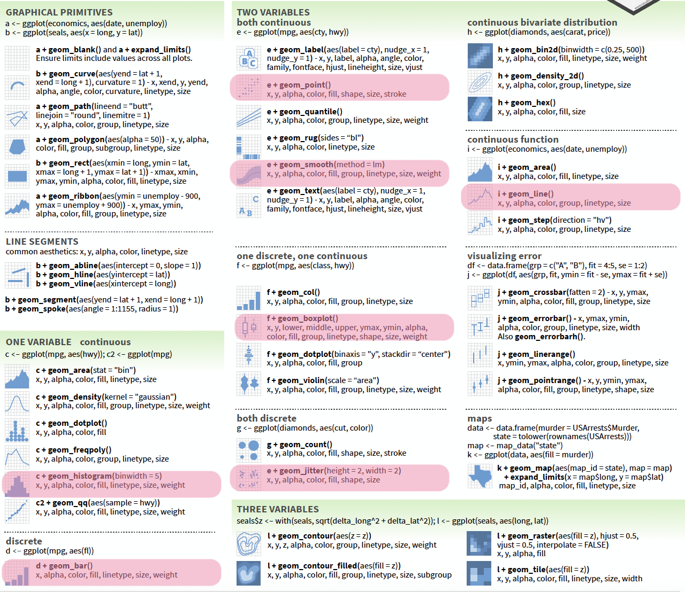
```

## 4 - *stats*

Les transformations statistiques (stats) transforment les données, typiquement en les résumant d'une certaine manière (ex: moyenne).

Ils s'utilisent soit :

- dans les geoms `geom_point()`

```{r, out.height="30%", fig.align='center', message=FALSE, warning=FALSE}
ggplot(iris, aes(x = Species, y = Sepal.Width)) + 
   geom_point() + # toutes les données
   geom_point(stat = "summary", fun.y = "mean", col = "red", size = 4)
```
* Ou dans son propre layer (`stat_...()`)
```{r eval=FALSE}
ggplot(iris, aes(x = Species, y = Sepal.Width)) + 
   geom_point() + # toutes les données
   stat_summary(fun = "mean", col = "red", size = 2)
```

## 5 - *scale*

Les *scales* controlent le mapping des datas aux aesthetics.
Ils controlent également les éléments graphiques comme les axes, légende, ...

```{r, out.height="60%", fig.align='center', message=FALSE}
my_color <- c("#388ECC", "#F68B33", "#C2C2C2")
ggplot(iris, aes(x = Sepal.Length, y = Sepal.Width)) + 
   geom_point(aes(col = Species)) +
   scale_color_manual(values = (my_color))
```

##

```{r, out.height="60%", fig.align='center', message=FALSE, echo=TRUE}
my_color <- c("#388ECC", "#F68B33", "#C2C2C2")
ggplot(iris, aes(x = Sepal.Length, y = Sepal.Width)) + 
   geom_jitter(aes(col = Species)) + 
   scale_color_manual(values = (my_color)) +
   scale_x_continuous(breaks = c(4.5,5,8)) +
   scale_y_continuous(minor_breaks = seq(2,5, by = 0.1))
```

##

```{r, out.height="60%", fig.align='center', message=FALSE, echo=TRUE}
gg <- ggplot(iris, aes(x = Sepal.Length, y = Sepal.Width)) + 
   geom_jitter(aes(col = sqrt(Petal.Width*Petal.Width))) +
   scale_color_gradient(low = "red", high = "blue")
gg
```

## 6 - Système de coordonnées

Pour:

- Définir les limites du graphe (et zoomer):

`gg + coord_cartesian(xlim = c(6,7), ylim = c(2.5, 3))`

- Inverser X et Y

`gg + coord_flip()`

- ...

## 7 - *Facetting*

Pour générer plusieurs graphes à partir de sous ensembles de données.

```{r, out.width="30%", echo=FALSE}
knitr::include_graphics("figure/position-facets.png")
```

```{r, out.height="35%"}
ggplot(iris, aes(Sepal.Length, Sepal.Width)) + 
   geom_point() +
   facet_wrap(~Species) +
   ggtitle("Facet Wrap")
```

## 
```{r, out.height="80%", fig.align="center"}
ggplot(diamonds, aes(carat, price, col = clarity)) + 
   geom_point() +
   facet_grid(cut~color) +
   ggtitle("Facet Grid")
```


## 8 - Thème

Pour customiser l'affichage.
Quelques thèmes pré-défini:

```{r, out.height="80%", fig.align="center", echo=F}
g1 <- ggplot(diamonds, aes(carat, price, col = color)) + 
   geom_point() + theme_classic() + 
   ggtitle("+ theme_classic()")
g2 <- ggplot(diamonds, aes(carat, price, col = color)) + 
   geom_point() + theme_bw() +
      ggtitle("+ theme_bw()")

g3 <- ggplot(diamonds, aes(carat, price, col = color)) + 
   geom_point() + theme_dark() +
      ggtitle("+ theme_dark()")

g4 <- ggplot(diamonds, aes(carat, price, col = color)) + 
   geom_point() + theme_minimal() +
      ggtitle("+ theme_minimal()")
grid.arrange(g1,g2,g3,g4, ncol=2)
```


## Autres astuces

- sauvegarder: `ggsave()`
- position de la légende `+ theme(legend.position = "bottom")`
- tite: `+ ggtitle("Title")`
- titre des axes: `+ labs(x = "Axe X")`
- titre légende: `+ labs(color = "Legend title")` *ou fill, ... dépend du type d'aes*
- rotation et position des labels d'axe:

`+ theme(axis.text.x = element_text(angle = 90, vjust = 0.5, hjust=1))`

# Quelques Graphiques utiles en Bioinformatique

## 1- Boxplot

```{r, echo=TRUE, out.height="70%"}
ggplot(diamonds, aes(x = color, y = price, fill = color)) + 
   geom_boxplot() + theme_bw()
```


## 2- Histogramme
```{r,  out.height="70%"}
ggplot(iris, aes(Sepal.Length)) + 
   geom_histogram(binwidth = 0.1) + theme_bw()
```

## 3- Barplot

```{r, message=FALSE, echo=FALSE}
fruit <- read_tsv("../Linux Pratique/linux/exo3/fruit.tsv")
```

```{r, eval=FALSE, echo=TRUE}
ggplot(fruit, aes(FRUIT, QUANTITE)) + 
   geom_bar(stat = "identity", width = 0.5)

ggplot(fruit, aes(COULEUR, QUANTITE, fill=FRUIT)) + 
   geom_bar(stat = "identity", position="dodge", width = 0.5)
```
```{r, echo=FALSE, out.width="70%"}
g1 <- ggplot(fruit, aes(FRUIT, QUANTITE)) + 
   geom_bar(stat = "identity", width = 0.5)

g2 <- ggplot(fruit, aes(COULEUR, QUANTITE, fill=FRUIT)) + 
   geom_bar(stat = "identity", position="dodge", width = 0.5)
grid.arrange(g1,g2, ncol = 2)
```

## 4- Volcano Plot

Un *Volcano plot* est un type de diagramme de nuage de
points qui montre une signification statistique (valeur de p-value) par rapport à l'ampleur du changement (logFoldchange)

```{r, echo=FALSE, out.width="50%", fig.align='center', message=FALSE}
knitr::include_graphics("figure/volcanoplot.png")
```


## 5- Manhantan plot

Le *manhantan plot* est un type de diagramme de nuage de
points Le tracé est couramment utilisé dans les études d'association génomique (GWAS) pour afficher des SNP significatifs.

```{r, echo=FALSE, out.width="70%", fig.align='center', message=FALSE}
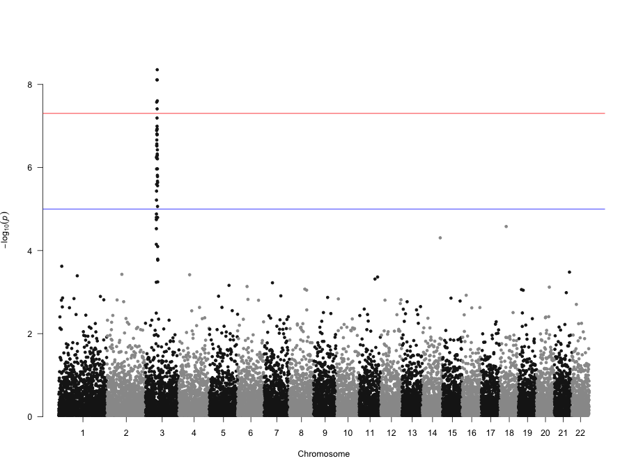
```

## 6- QQ plot

Un graphique quantile-quantile (QQ) peut être utilisé pour caractériser dans quelle mesure la distribution observée de la statistique suit les prévisions (distribution nulle).

```{r, echo=FALSE, out.width="70%", fig.align='center', message=FALSE}
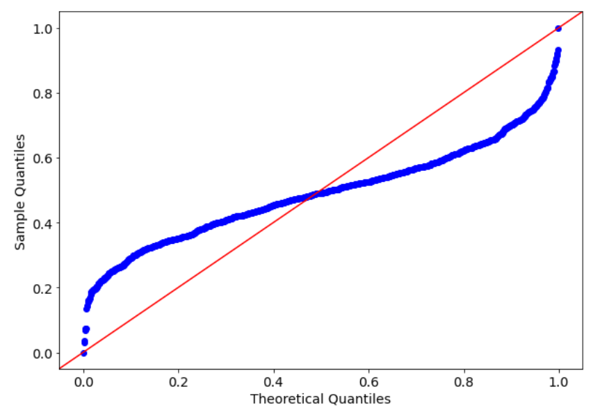
```

## 7- Venn diagram

Graphique utilisé pour représenter des relations logiques entre ensembles

```{r, echo=FALSE, out.width="60%", fig.align='center', message=FALSE}
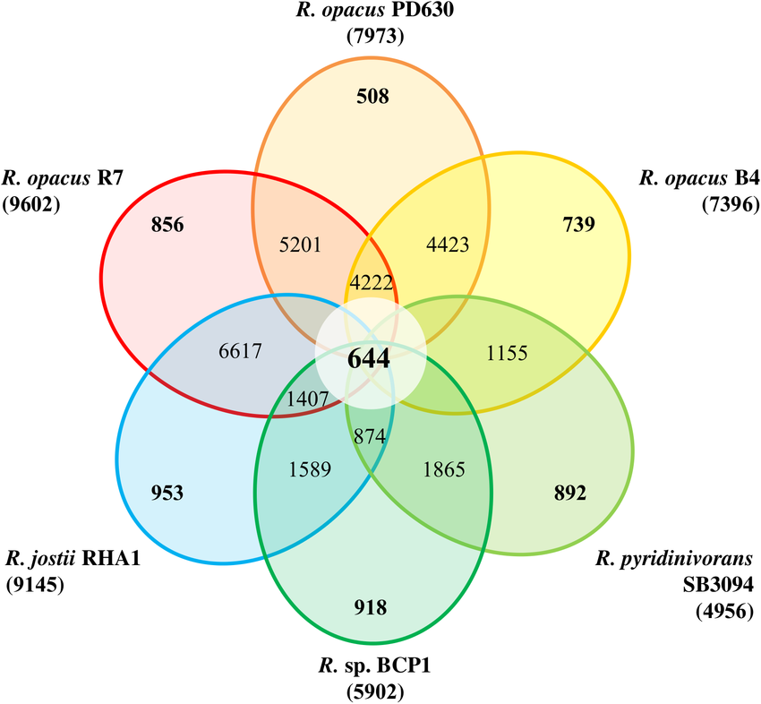
```


# Discussion sur les bonnes pratiques de visualisation des données

## Bonne pratiques de visualisation des données

Quelques bonnes pratiques à garder à l'esprit:

- Choisissez le meilleur visuel pour vos données et son objectif.
- Assurez-vous que vos données sont facilement compréhensibles et visibles.
- Offrez le contexte nécessaire à votre public dans et autour de votre visuel.
- Gardez votre visuel aussi simple et direct que possible.

## Mauvaises habitudes

- Manque d'étiquetage clair des axes
- Tronquer un axe (termine ou commence à un endroit trompeur)
- Les nombres ne s'additionnent pas correctement (Pie chart)
- Mauvaise utilisation d'un type de graphique
- *Cherrypicking* des données
- Mauvais choix graphiques (comme des choix de couleurs à faible contraste ou une perspective déformante)
- Pas de titre
- Pas de legende

## Exemple

```{r, echo=FALSE, out.width="70%", fig.align='center', message=FALSE}
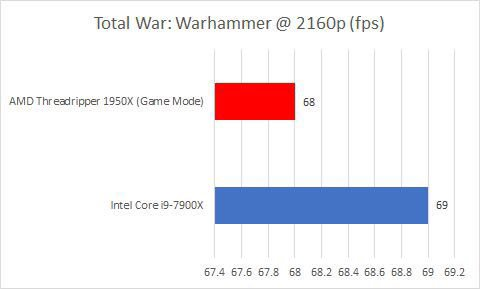
```

- L'erreur ici est simple: l'axe des x doit commencer à zéro.

https://getdolphins.com/wp-content/uploads/2018/02/DG5UK_WUAAAVQe5.jpg

## Exemple

```{r, echo=FALSE, out.width="30%", fig.align='center', message=FALSE}
knitr::include_graphics("figure/wrong_3d.jpg")
```

- Le rendu tridimensionnel des courbes est inutile.

https://www.biostat.wisc.edu/%7Ekbroman/topten_worstgraphs/roeder_fig4.jpg

## Exemple

```{r, echo=FALSE, out.width="70%", fig.align='center', message=FALSE}
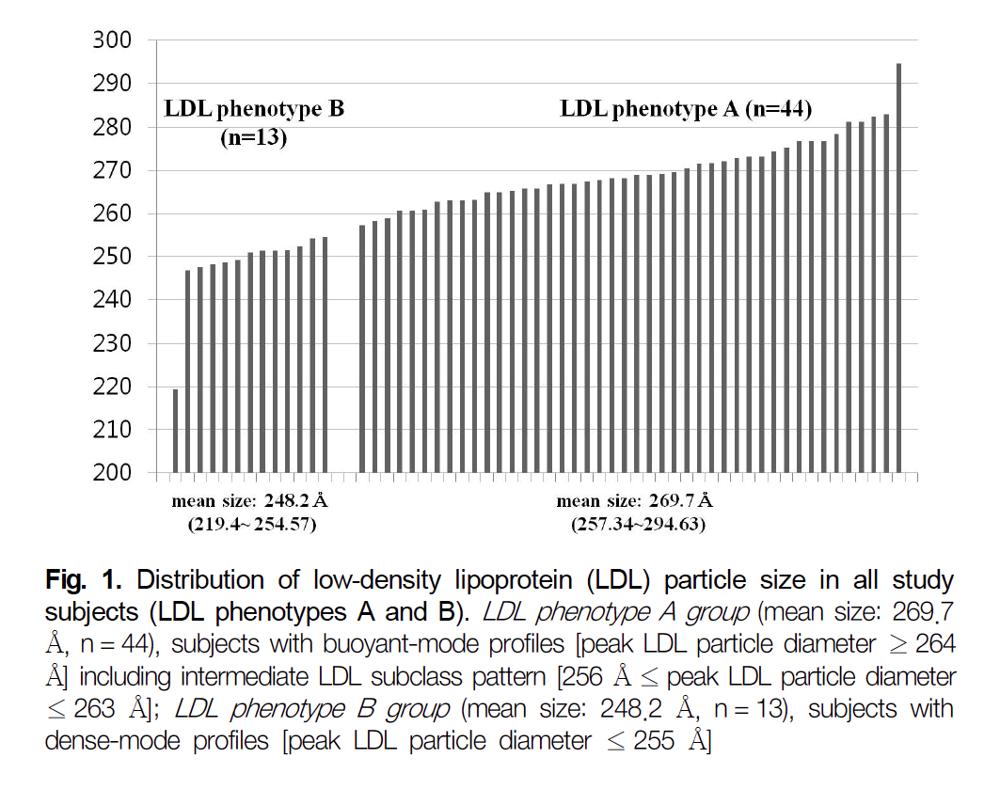
```

Mauvais choix de graphe: l'utilisation d'une barre distincte pour chaque individu est inutile et difficile à lire.

https://www.biostat.wisc.edu/%7Ekbroman/topten_worstgraphs/kim_fig1.png

## Exemple

```{r, echo=FALSE, out.width="70%", fig.align='center', message=FALSE}
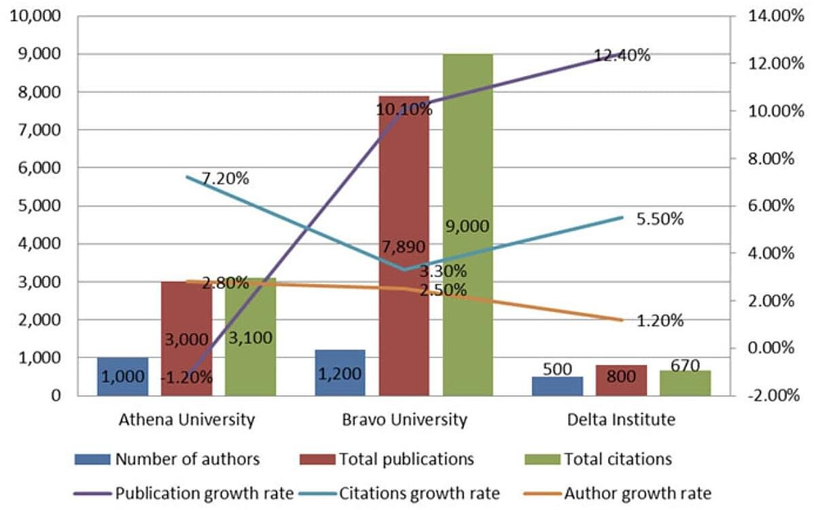
```

- Plusieurs variables complètement différentes dans un même visuel.

https://blog.hubspot.com/marketing/great-data-visualization-examples

## Exemple

```{r, echo=FALSE, out.width="70%",fig.align='center', message=FALSE}
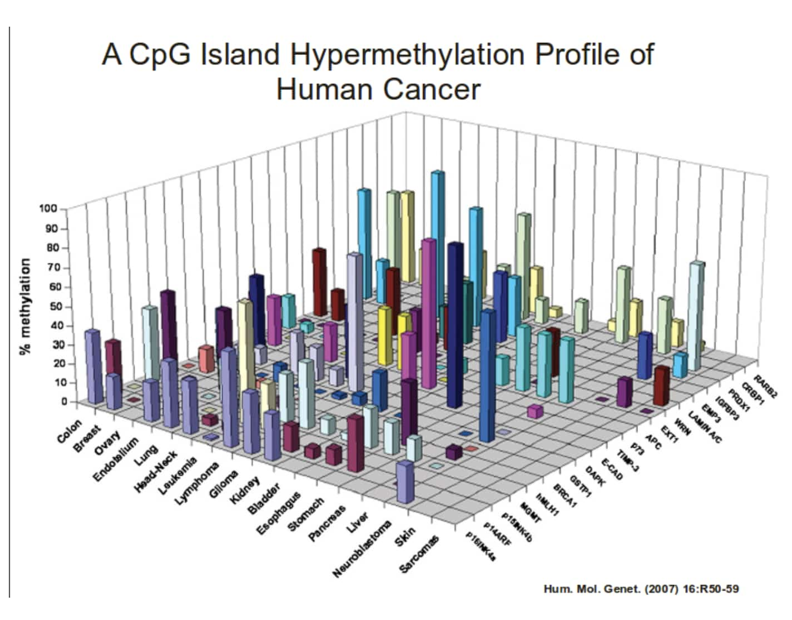
```

- 3D inutile et rend le graphique plus compliqué à lire (heatmap).

https://blog.hubspot.com/marketing/great-data-visualization-examples